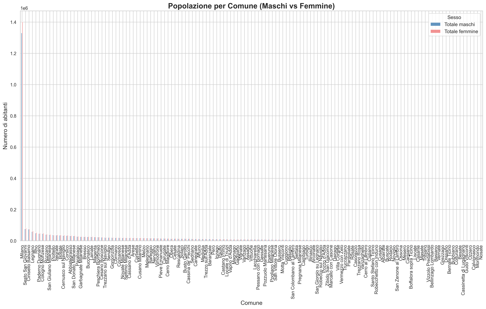

# Analisi demografica ISTAT - Milano

Questo progetto analizza i dati ISTAT sulla popolazione dei comuni della Città Metropolitana di Milano.  
L’obiettivo è mostrare la distribuzione della popolazione maschile e femminile per ciascun comune, con grafici chiari e riproducibili.

---

## 📂 Contenuti del repository
- **Dataset ufficiale**: `DCIS_POPRES.csv`  
- **Notebook Jupyter**: `MilanoTab.ipynb`  
- **Grafico popolazione per comune**: `grafico_comuni.png`  

---

## 📊 Risultato principale


Il grafico mostra la popolazione maschile (blu) e femminile (rosso chiaro) per ogni comune della Città Metropolitana di Milano.

---

## ⚙️ Come eseguire l’analisi
1. Clona il repository:
   ```bash
   git clone https://github.com/luckydrew1994/Demo-ISTAT-Milano.git
   cd Demo-ISTAT-Milano
